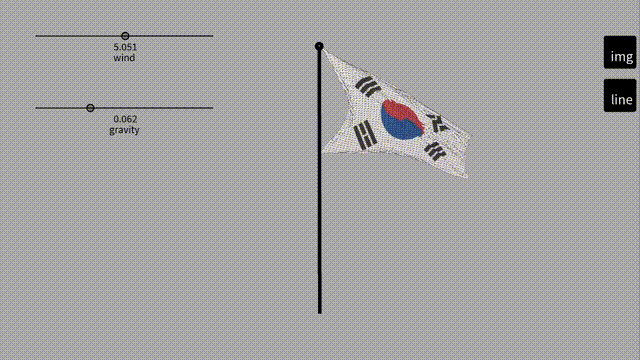

# Flag simulation

This is my first year of high school project which is made in 2021.
It simulates flags with [Processing](https://processing.org/)

## Demo

## How it works

It uses [verlet integration](https://en.wikipedia.org/wiki/Verlet_integration) to simulate the movement of the flag.
The flag is made up of a grid of `Points `that are connected by `Lines`.

## How to run

Simply install Processing version over 3.5.4 and open `/src` folder.
Press `Ctrl + R` to run the sketch.
